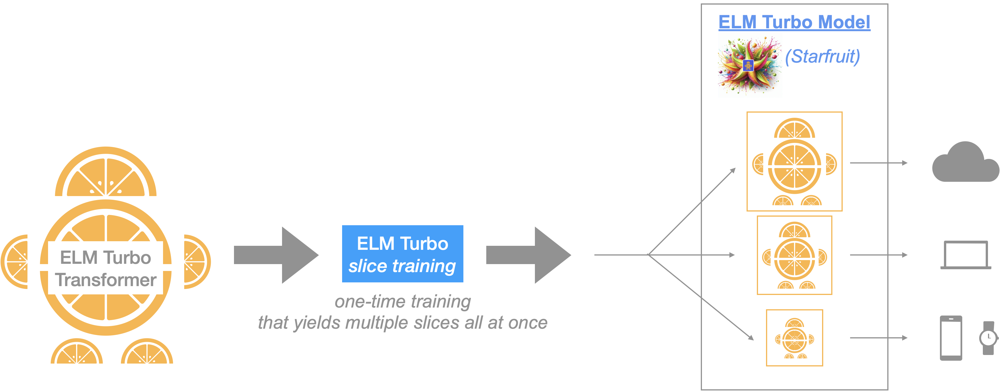

# SliceX AI™ ELM Turbo
**ELM** (which stands for **E**fficient **L**anguage **M**odels) **Turbo** is the next generation model in the series of cutting-edge language models from [SliceX AI](https://slicex.ai) that is designed to achieve the best in class performance in terms of _quality_, _throughput_ & _memory_.

<div align="center">
  
</div>

ELM is designed to be a modular and customizable family of neural networks that are highly efficient and performant. Today we are sharing the second version in this series: **ELM Turbo** models (named _Starfruit_). 

_Model:_ ELM Turbo introduces a more _adaptable_, _decomposable LLM architecture_ thereby yielding flexibility in (de)-composing LLM models into smaller stand-alone slices. In comparison to our previous version, the new architecture allows for more powerful model slices to be learnt during the training process (yielding better quality & higher generative capacity) and a higher level of control wrt LLM efficiency - fine-grained slices to produce varying LLM model sizes (depending on the user/task needs and deployment criteria, i.e., Cloud or Edge device constraints).

_Training:_ ELM Turbo introduces algorithmic optimizations that allows us to train a single model but once trained the ELM Turbo model can be sliced in many ways to fit different user/task needs. We formulate the entire training procedure for ELM Turbo as a _continual learning process_ during which we apply **"slicing"** operations & corresponding optimizations during the pre-training and/or fine-tuning stage. In a nutshell, this procedure _teaches the model to learn & compress its knowledge into smaller slices_.

_Fast Inference with Customization:_ As with our previous version, once trained, ELM Turbo model architecture permits flexible inference strategies at runtime depending on deployment & device constraints to allow users to make optimal compute/memory tradeoff choices for their application needs. In addition to the blazing fast speeds achieved by native ELM Turbo slice optimization, we also layered in NVIDIA's TensorRT-LLM integration to get further speedups. The end result 👉 optimized ELM Turbo models that achieve one of the world's best LLM performance.

- **Blog:** [Medium](https://medium.com/sujith-ravi/introducing-elm-turbo-next-generation-efficient-decomposable-llms-a2347bd08676)

- **Github:** https://github.com/slicex-ai/elm-turbo

- **HuggingFace** (access ELM Turbo Models in HF): 👉  [LLama-3.1](https://huggingface.co/collections/slicexai/llama31-elm-turbo-66a81aa5f6bcb0b775ba5dd7) & [original](https://huggingface.co/collections/slicexai/elm-turbo-66945032f3626024aa066fde) versions

## ELM Turbo Model Release (🆕 now available for Llama 3.1 as well)
In this version, we employed our new, improved decomposable ELM techniques on widely used open-source LLMs, `meta-llama/Meta-Llama-3.1-8B-Instruct` (8B params) and `microsoft/Phi-3-mini-128k-instruct` (3.82B params) (check [Llama-license](https://huggingface.co/meta-llama/Meta-Llama-3.1-8B/blob/main/LICENSE) and [phi3-license](https://huggingface.co/microsoft/Phi-3-mini-128k-instruct/resolve/main/LICENSE) for usage). After training, we generated three smaller slices with parameter counts ranging from 1.33 billion to 6.3 billion. Furthermore, we seamlessly integrated these slices into NVIDIA's [TensoRT-LLM](https://github.com/NVIDIA/TensorRT-LLM), providing trtllm engines compatible with A100 and H100 GPUs, respectively. 

- [Section 1.](https://github.com/slicex-ai/elm-turbo/tree/main?tab=readme-ov-file#1-run-elm-turbo-models-with-huggingface-transformers-library) 👉 instructions to run ELM-Turbo with the Huggingface Transformers library :hugs:.
- [Section 2.](https://github.com/slicex-ai/elm-turbo/tree/main?tab=readme-ov-file#2-running-elm-turbo-via-nvidias-tensorrt-llm) 👉 instructions to run ELM-Turbo engines powered by NVIDIA's TensoRT-LLM. 

**NOTE**: The open-source datasets from the HuggingFace hub used for instruction fine-tuning ELM Turbo include, but are not limited to: `allenai/tulu-v2-sft-mixture`, `microsoft/orca-math-word-problems-200k`, `mlabonne/WizardLM_evol_instruct_70k-ShareGPT`, and `mlabonne/WizardLM_evol_instruct_v2_196K-ShareGPT`. We advise users to exercise caution when utilizing ELM Turbo, as these datasets may contain factually incorrect information, unintended biases, inappropriate content, and other potential issues. It is recommended to thoroughly evaluate the model's outputs and implement appropriate safeguards for your specific use case.

## 1. Run ELM Turbo models with Huggingface Transformers library.
There are three ELM Turbo slices derived from the `Meta-Llama-3.1-8B-Instruct` (8B params) model: 
  1. `slicexai/Llama3.1-elm-turbo-3B-instruct` (3.1B params)
  2. `slicexai/Llama3.1-elm-turbo-4B-instruct`(4.1B params)
  3. `slicexai/Llama3.1-elm-turbo-6B-instruct` (6.3B params) 

There are three ELM Turbo slices derived from the `phi3-mini` (3.82B params) model: 
  1. `slicexai/elm-turbo-0.125-instruct` (1.33B params)
  2. `slicexai/elm-turbo-0.25-instruct`(1.56B params)
  3. `slicexai/elm-turbo-0.50-instruct` (2.01B params) 

Required packages for [Hugginface Phi-3-mini](https://huggingface.co/microsoft/Phi-3-mini-128k-instruct) & corresponding ELM Turbo model slices.
```bash
flash_attn==2.5.8
torch==2.3.1
accelerate==0.31.0
transformers==4.41.2
```

Required Packages for [Meta-Llama-3.1-8B-Instruct](meta-llama/Meta-Llama-3.1-8B-Instruct) & corresponding ELM Turbo model slices.
```
transformers==4.43.3
```

Example - To run the `slicexai/Llama3.1-elm-turbo-4B-instruct`
```python
from transformers import AutoModelForCausalLM, AutoTokenizer, pipeline
import torch

elm_turbo_model = "slicexai/Llama3.1-elm-turbo-4B-instruct"
model = AutoModelForCausalLM.from_pretrained( 
    elm_turbo_model,  
    device_map="cuda",  
    torch_dtype=torch.bfloat16,  
    trust_remote_code=True
)
messages = [ 
    {"role": "user", "content": "Can you provide ways to eat combinations of bananas and dragonfruits?"}, 
]

tokenizer = AutoTokenizer.from_pretrained(elm_turbo_model, legacy=False) 
pipe = pipeline( 
    "text-generation", 
    model=model, 
    tokenizer=tokenizer, 
) 

generation_args = { 
    "max_new_tokens": 500, 
    "return_full_text": False,
    "repetition_penalty": 1.2,
    "temperature": 0.0, 
    "do_sample": False, 
} 

output = pipe(messages, **generation_args) 
print(output[0]['generated_text']) 
```


Example - To run the `slicexai/elm-turbo-0.50-instruct`
```python
from transformers import AutoModelForCausalLM, AutoTokenizer, pipeline
import torch

elm_turbo_model = "slicexai/elm-turbo-0.50-instruct"
model = AutoModelForCausalLM.from_pretrained( 
    elm_turbo_model,  
    device_map="cuda",  
    torch_dtype=torch.bfloat16,  
    trust_remote_code=True,
    attn_implementation="flash_attention_2"
)
messages = [ 
    {"role": "user", "content": "Can you provide ways to eat combinations of bananas and dragonfruits?"}, 
]

tokenizer = AutoTokenizer.from_pretrained(elm_turbo_model, legacy=False) 
pipe = pipeline( 
    "text-generation", 
    model=model, 
    tokenizer=tokenizer, 
) 

generation_args = { 
    "max_new_tokens": 500, 
    "return_full_text": False,
    "repetition_penalty": 1.2,
    "temperature": 0.0, 
    "do_sample": False, 
} 

output = pipe(messages, **generation_args) 
print(output[0]['generated_text']) 
```

## 2. Running ELM Turbo via Nvidia's TensorRT-LLM

- **[Cloud AI]** If you are using A100 or H100 GPUs, you can utilize our pre-built ELM Turbo-TRTLLM engines. Below are the instructions to install and run them.

- Additionally, you can build your own TRTLLM engines by following the instructions provided in [Section (c)](https://github.com/slicex-ai/elm-turbo/blob/main/README.md#c-optional-create--run-your-own-elm-turbo-trtllm-engines-from-elm-turbo-huggingfacehf-checkpoints) below.

- **[Edge AI]** To run on edge (Windows RTX), follow the instructions provided by Nvidia in their TRT-LLM documentation: [Windows README](https://github.com/NVIDIA/TensorRT-LLM/blob/main/windows/README.md).


### (a) Download & install Nvidia's TensorRT-LLM with docker.
The following commands create a Docker container named `elm_trtllm` and install TensorRT-LLM. If you encounter any installation errors related to TensorRT-LLM, please refer to the troubleshooting section [here](https://nvidia.github.io/TensorRT-LLM/reference/troubleshooting.html).
```
git clone https://github.com/slicex-ai/elm-turbo.git
cd elm-turbo
sh setup_trtllm.sh
```
This creates a docker named `elm_trtllm` and installs tensorrt_llm. 

### (b) Run pre-built ELM Turbo-trtllm engines with your input prompts.

Example: To run our pre-built trt-engine for `slicexai/Llama3.1-elm-turbo-4B-instruct` on A100 & H100 gpus respectively,
```
docker attach elm_trtllm
cd /lm
sh run_llama_elm_turbo_trtllm_engine.sh slicexai/Llama3.1-elm-turbo-4B-instruct A100 "plan a fun day with my grandparents."
sh run_llama_elm_turbo_trtllm_engine.sh slicexai/Llama3.1-elm-turbo-4B-instruct H100 "plan a fun day with my grandparents."
```

Detailed instructions to run the engine:
```
Usage: sh run_llama_elm_turbo_trtllm_engine.sh <elm_turbo_model_id> <gpu_type> "<input_prompt>"
Supported elm-turbo_model_id choices : [slicexai/Llama3.1-elm-turbo-6B-instruct, slicexai/Llama3.1-elm-turbo-4B-instruct, slicexai/Llama3.1-elm-turbo-3B-instruct]
Supported gpu_types : [A100, H100]
```


### (c) (Optional) Create & run your own ELM Turbo-trtllm engines from ELM Turbo Huggingface(HF) checkpoints.

#### Compile the Model into a TensorRT-LLM Engine
To build an elm-turbo `slicexai/Llama3.1-elm-turbo-6B-instruct` tensortrt_llm engine with INT-8 quantization, follow the instructions below. For more detailed configurations, refer to the Llama conversion instructions provided by NVIDIA [here](https://github.com/NVIDIA/TensorRT-LLM/tree/main/examples/llama).

```bash
docker attach elm_trtllm
cd /lm/TensorRT-LLM/examples/llama
huggingface-cli download slicexai/Llama3.1-elm-turbo-6B-instruct --local-dir ../slicexai/Llama3.1-elm-turbo-6B-instruct
python3 convert_checkpoint.py --dtype bfloat16 --use_weight_only --weight_only_precision int8  --model_dir ../slicexai/Llama3.1-elm-turbo-6B-instruct --output_dir ../slicexai/Llama3.1-elm-turbo-6B-instruct-trtllm-ckpt
trtllm-build --gpt_attention_plugin bfloat16 --gemm_plugin bfloat16 --max_seq_len 4096 --max_batch_size 256 --checkpoint_dir ../slicexai/Llama3.1-elm-turbo-6B-instruct-trtllm-ckpt --output_dir ../slicexai/Llama3.1-elm-turbo-6B-instruct-trtllm-engine
```

#### Run the Model
Now that you’ve got your model engine, it's time to run it.

```bash
python3 ../run.py \
  --engine_dir ../slicexai/Llama3.1-elm-turbo-6B-instruct-trtllm-engine \
  --max_output_len 512 \
  --presence_penalty 0.7 \
  --frequency_penalty 0.7 \
  --tokenizer_dir ../slicexai/Llama3.1-elm-turbo-6B-instruct \
  --input_text """<|begin_of_text|><|start_header_id|>user<|end_header_id|>
    
    plan a fun day with my grandparents.<|eot_id|><|start_header_id|>assistant<|end_header_id|>
    
    """
```
